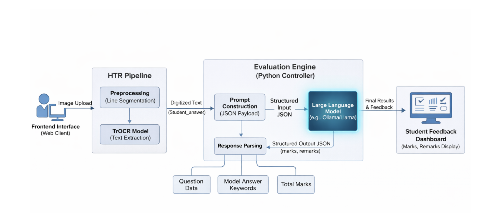

# EasyEval: Automated Handwritten Answer Sheet Evaluation System

[](https://www.python.org/)
[](LICENSE)
[]()

> **Closing the feedback loop in education by automating the grading of handwritten descriptive answers with speed, objectivity, and actionable insights.**

## 📄 Overview

Manual evaluation of handwritten exam papers is time-consuming, prone to unconscious bias, and often fails to provide students with meaningful feedback beyond a numerical score.

**EasyEval** addresses these challenges by creating an end-to-end automated grading pipeline. It combines computer vision (for reading handwriting) with natural language processing (for evaluating content against a rubric).

The system takes images of handwritten answer sheets, digitizes the text using a specialized Handwritten Text Recognition (HTR) pipeline, and then uses a customized Large Language Model (LLM) to act as a strict, objective examiner, providing both marks and detailed qualitative remarks.

## ✨ Key Features

* **Robust HTR Pipeline:** Handles handwritten text through intelligent line segmentation preprocessing followed by a Transformer-based Optical Character Recognition (TrOCR) model.
* **Bias-Free Grading:** The LLM evaluation engine is grounded by explicit `model_answer_keywords`, ensuring every student is graded against the exact same criteria.
* **Actionable Feedback Engine:** Unlike standard auto-graders, EasyEval generates structured remarks explaining *why* marks were awarded or deducted, helping students learn from their mistakes.
* **Structured Output:** Enforces strict JSON output from the LLM `{marks, remarks}` for easy integration into dashboards and databases.
* **Web Interface:** Simple frontend for teachers to define questions/rubrics and upload student scripts.

## 🏗️ System Architecture

EasyEval operates as a sequential pipeline designed to handle the noise of real-world handwritten documents.


<!-- *(Note: Replace `path/to/your/architecture_diagram.png` with the actual path to the diagram image in your repo)* -->

### The Workflow:

1.  **Input:** User uploads an image of an answer sheet via the web frontend.
2.  **Preprocessing & Segmentation:** The image goes through the HTR pipeline where OpenCV is used to detect and isolate individual lines of text.
3.  **Text Extraction (TrOCR):** Segmented lines are passed to a pre-trained TrOCR model to convert images into digital text strings.
4.  **Structured Evaluation Engine:** The extracted student answer is bundled into a JSON payload along with the Question, Total Marks, and required Keywords.
5.  **LLM Inference (Ollama):** This payload is sent to a locally hosted LLM (e.g., Llama 2). The LLM is prompted to act as an examiner and output strictly formatted JSON containing the final grade and feedback remarks.

## 🛠️ Tech Stack

* **Python**: Core backend logic.
* **PyTorch & Hugging Face Transformers**: Used for implementing and running the TrOCR model.
* **OpenCV**: Image preprocessing and line segmentation.
* **Ollama**: Framework for running Large Language Models locally.
* **Backend Framework**: Flask
* **Frontend**: HTML/CSS/JS

## 🚀 Getting Started

### Prerequisites

* Python 3.8+
* Git
* [Ollama](https://ollama.ai/) installed and running locally.
* Recommended: GPU for faster inference (CUDA enabled for PyTorch).

### Installation

1.  **Clone the repository:**
    ```bash
    git clone [https://github.com/anand2468/easy-eval.git](https://github.com/yourusername/easy-eval.git)
    cd easy-eval
    ```

2.  **Create and activate a virtual environment: (optional)**
    ```bash
    python -m venv venv
    # On Windows:
    venv\Scripts\activate
    # On macOS/Linux:
    source venv/bin/activate
    ```

3.  **Install dependencies:**
    ```bash
    pip install -r requirements.txt
    ```

4.  **Set up Ollama:**
    Ensure Ollama is running and pull the model you intend to use (e.g., Llama 2 or Mistral):
    ```bash
    ollama pull gemma3:latest
    ```

### Running the Application

1.  **Start the Server:**
    ```bash
    python app.py 
    ```

<!-- 2.  **Start the Frontend (if separate):**
    ```bash
    # Commands to start your frontend, e.g., npm start or opening index.html
    ``` -->

3.  Access the application in your browser at `http://localhost:5000`.

<!-- ## 📸 Screenshots

### 1. Defining a Question and Rubric

*(TODO: Insert screenshot of the interface where teachers input the question, keywords, and marks)*

### 2. Results Dashboard with Remarks

*(TODO: Insert screenshot showing an uploaded handwritten image next to the generated marks and feedback)* -->

## 🛣️ Future Roadmap

* Fine-tuning TrOCR specifically on messy student handwriting datasets to improve Word Error Rate (WER).
* Integrating multi-modal LLMs (like LLaVA) to attempt end-to-end grading without explicit OCR steps.
* Support for grading diagrams and flowcharts alongside text.

<!-- ## 👥 Contributors

* P. 
* [Name 2]
* [Name 3]
* [Name 4] -->

## 📄 License

This project is licensed under the MIT License - see the [LICENSE](LICENSE) file for details.